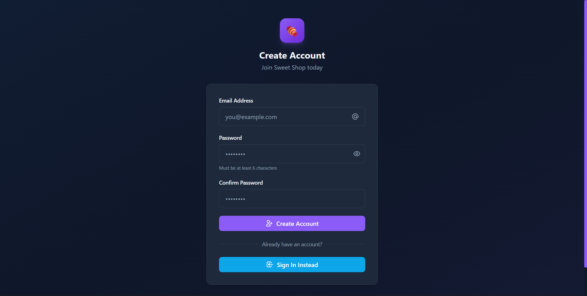
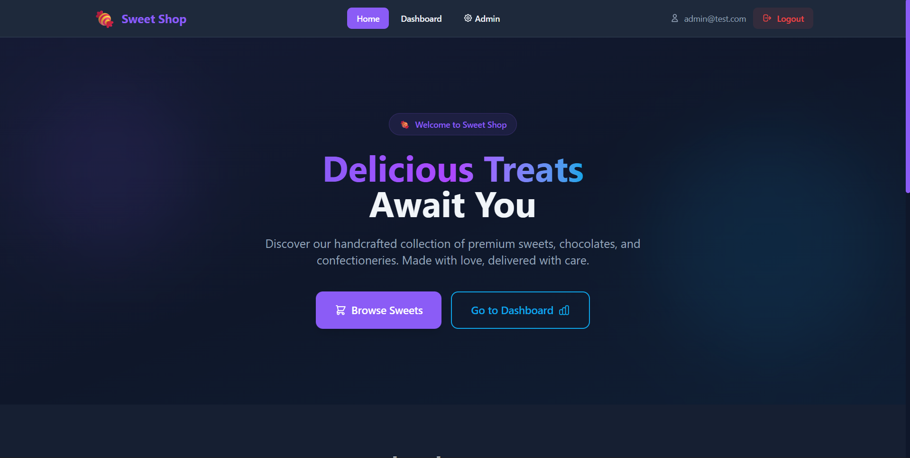
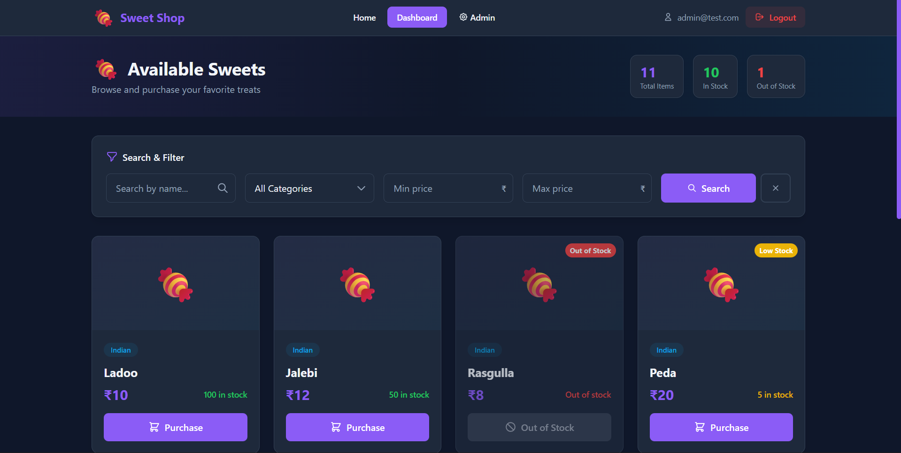
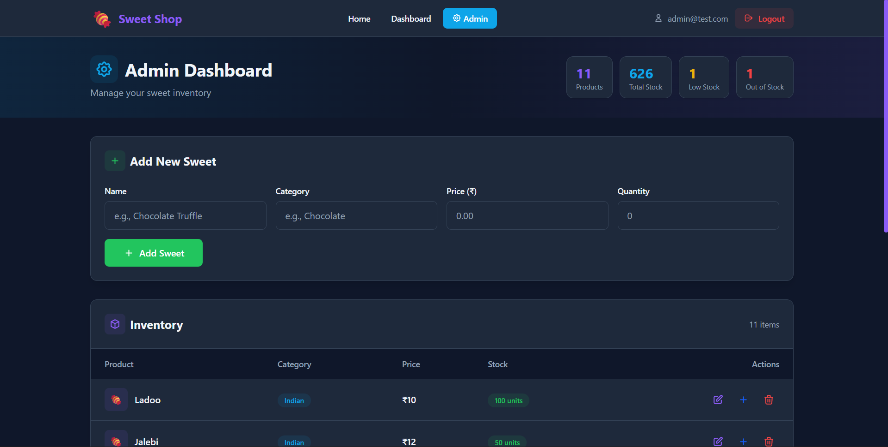
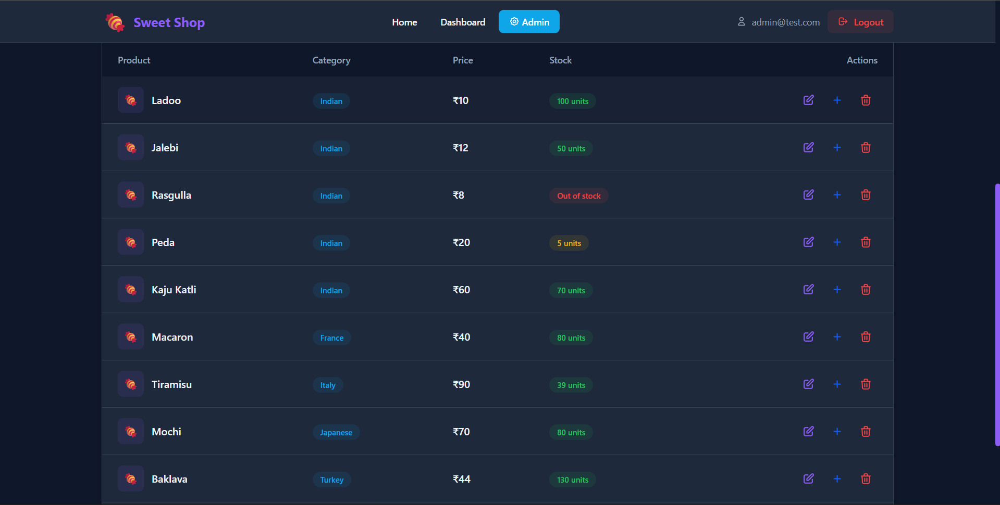

# 🍬 Sweet Shop Management System

A full‑stack Sweet Shop Management System built as a **TDD kata** to demonstrate backend API design, database integration, authentication, authorization, frontend development, testing, and modern deployment workflows.

The project follows clean coding practices, test‑driven development (TDD), and transparent AI‑assisted development, as required by the assignment.

---

## 📌 Project Overview

The Sweet Shop Management System allows users to:

- Register and log in using secure authentication
- View available sweets
- Search sweets by name, category, or price range
- Purchase sweets (inventory updates automatically)

Admin users can additionally:

- Add new sweets
- Update sweet details
- Delete sweets
- Restock inventory

The application is fully deployed with:
- **Backend** on Render
- **Frontend** on Vercel
- **Database** on MongoDB Atlas

---

## 🏗️ Tech Stack

### Backend
- **Framework:** FastAPI (Python)
- **Database:** MongoDB (MongoDB Atlas)
- **Async Driver:** Motor
- **Authentication:** JWT (JSON Web Tokens)
- **Password Hashing:** Argon2
- **Testing:** Pytest, pytest‑asyncio

### Frontend
- **Framework:** Next.js (App Router)
- **Language:** TypeScript
- **HTTP Client:** Axios
- **UI:** Custom components + modern UI overhaul

### Deployment
- **Backend Hosting:** Render
- **Frontend Hosting:** Vercel
- **Database Hosting:** MongoDB Atlas

---

## 🧩 Architecture Overview

```
Frontend (Next.js)
   |
   |  HTTPS (Axios)
   v
Backend API (FastAPI on Render)
   |
   |  Async MongoDB Driver (Motor)
   v
Database (MongoDB Atlas)
```

---

## 🔐 Authentication & Authorization

- Users authenticate using **JWT tokens**
- Tokens are issued on login and sent in the `Authorization` header
- Protected routes require a valid JWT
- **Role‑Based Access Control (RBAC)** is implemented:
  - `user`: can view and purchase sweets
  - `admin`: can add, update, delete, and restock sweets

---

## 📡 Backend API Endpoints

### Auth
| Method | Endpoint | Description |
|------|--------|------------|
| POST | `/api/auth/register` | Register a new user |
| POST | `/api/auth/login` | Login and receive JWT |

### Sweets (Protected)
| Method | Endpoint | Description |
|------|--------|------------|
| POST | `/api/sweets` | Add a new sweet (Admin) |
| GET | `/api/sweets` | List all sweets |
| GET | `/api/sweets/search` | Search sweets |
| PUT | `/api/sweets/{id}` | Update sweet (Admin) |
| DELETE | `/api/sweets/{id}` | Delete sweet (Admin) |

### Inventory (Protected)
| Method | Endpoint | Description |
|------|--------|------------|
| POST | `/api/inventory/{sweet_id}/purchase` | Purchase sweet |
| POST | `/api/inventory/{sweet_id}/restock` | Restock sweet (Admin) |

---

## 🧪 Test‑Driven Development (TDD)

The backend was developed using **Test‑Driven Development**:

- Tests were written **before** implementing features
- Clear **Red → Green → Refactor** workflow
- Separate test files for:
  - Authentication
  - Security utilities
  - Database connection
  - User repository
  - Sweets CRUD
  - Inventory operations

Example:
- Write failing test for user registration (Red)
- Implement logic to pass test (Green)
- Refactor repository/service code safely

All tests pass successfully before each major step.

---

## 🗄️ Database Design (MongoDB)

### Database
- **Name:** `sweet_shop`

### Collections

#### `users`
```json
{
  "_id": "ObjectId",
  "email": "string",
  "hashed_password": "string",
  "role": "user | admin"
}
```

#### `sweets`
```json
{
  "_id": "ObjectId",
  "name": "string",
  "category": "string",
  "price": number,
  "quantity": number
}
```

MongoDB creates databases and collections lazily on first write.

---

## 🚀 Deployment

### Backend (Render)

- Python Web Service
- Environment variables:
  ```env
  ENV=production
  MONGODB_URL=mongodb+srv://<user>:<password>@cluster0.xxxxx.mongodb.net
  MONGODB_DB_NAME=sweetshop
  JWT_SECRET_KEY=<secure_random_key>
  ```
- Start command:
  ```bash
  uvicorn app.main:app --host 0.0.0.0 --port $PORT
  ```

### Frontend (Vercel)

- Root directory: `frontend`
- Environment variable:
  ```env
  NEXT_PUBLIC_API_BASE_URL=https://sweet-shop-akyl.onrender.com
  ```

---

## 🔑 Admin Access (For Testing)

To test **admin-only features** such as adding, updating, deleting, and restocking sweets, you can use the following pre-created admin credentials:

- **Email:** `admin@test.com`
- **Password:** `admin@123`

After logging in with these credentials, the application will expose admin-specific UI elements and allow access to protected admin routes.

> ⚠️ Note: These credentials are provided **only for evaluation and testing purposes**.

---

## 📸 Screenshots

A quick visual tour of the app — click any image to view the full size.

<div align="center">

<table>
  <tr>
    <td align="center">
      <a href="screenshots/image-4.png"></a><br>
      <em>Login</em>
    </td>
    <td align="center">
      <a href="screenshots/image-5.png"></a><br>
      <em>Registration</em>
    </td>
    <td align="center">
      <a href="screenshots/image.png"></a><br>
      <em>Homepage</em>
    </td>
  </tr>
  <tr>
    <td align="center">
      <a href="screenshots/image-1.png"></a><br>
      <em>User Dashboard</em>
    </td>
    <td align="center">
      <a href="screenshots/image-2.png"></a><br>
      <em>Admin Panel</em>
    </td>
    <td align="center">
      <a href="screenshots/image-3.png"></a><br>
      <em>Admin Controls</em>
    </td>
  </tr>
</table>

</div>

## 🤖 My AI Usage

AI tools were used **responsibly and transparently** throughout this project to improve productivity and code quality.

### 🔧 AI Tools Used

- **ChatGPT**
- **Claude (Opus 4.5 model)**

### 🛠️ How AI Was Used

- **ChatGPT**:
  - Generated initial backend boilerplate
  - Helped design data models and API endpoint structure
  - Assisted in writing unit tests and debugging async issues
  - Provided explanations for errors during deployment and testing

- **Claude (Opus 4.5)**:
  - Used to overhaul the frontend UI
  - Refactored basic UI into a modern, responsive, and visually appealing interface
  - Improved UX patterns, layout, and component structure

All AI‑generated code was:
- Carefully reviewed
- Manually integrated
- Modified to fit project architecture
- Tested thoroughly

### 🧠 Reflection on AI Impact

AI significantly accelerated development by:
- Reducing boilerplate writing time
- Helping debug complex async and deployment issues
- Allowing focus on architecture and correctness rather than syntax

However, final decisions, integrations, refactors, and testing were done manually. AI acted as a **co‑pilot**, not a replacement.

AI usage is clearly documented via **co‑author commit messages** as required.

---

## 📎 Repository & Deployment Links

- **GitHub Repository:** https://github.com/aanubhavv/sweet-shop
- **Backend (Render):** https://sweet-shop-akyl.onrender.com
- **Frontend (Vercel):** https://sweet-shop-olive-omega.vercel.app/

---

## ✅ Final Notes

- Project follows clean architecture principles
- Fully tested backend with meaningful coverage
- Secure authentication and role‑based access control
- Production‑ready deployment setup

Thank you for reviewing this project.

